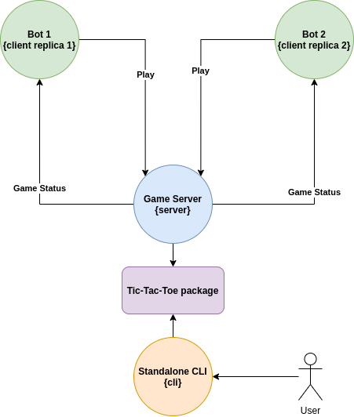

# Tic Tac Toe Game

Implements package, cli and api.

This guide assumes bash shell.

# Outdated -----
> cd tic-tac-toe  
> docker build .   
-------------------

## Selecting modes 
to run api:
> docker run -e MODE=api -p {port you want}:9090 -it {id or docker tag}

to run cli:
> docker run -e MODE=cli -it {id or docker tag}

## Api parameters to play manual
After running the server, through **curl** hit your local machine to the port binded with the next paths:

### GET {ip:port}/**create-board**/{size}   
to create a new board with that size (is set between 3 and 9)

### PUT {ip:port}/**send-play**/{X or O}/{row number}/{column number}  
to send the player and the coordinates where to place that play

### GET {ip:port}/**status**
to see status of the game (board, last player that played, winners)

*Once ended, must get another board in order to start again.*

## Playing with bots

### Implemented "random" and "linear" bot
Start a bot with the following parameters for example:

> cd bot_player
> go run bot.go -ip=127.0.0.1 -port={port binded} -strategy random -playfirst true -player X

### Options after ip and port:
| Parameter   | Options                                 |Description  |
| ----------- | ----------------------------------------|-------------|
| -strategy   | random, linear, donot_loose, try-to-win | string      |
| -player     | X, O                                    | string      |
| -playfirst  | true, false                             | boolean     |

## Docker Compose
This option is to see two bots playing with each other. In this case "random" against "try-to-win".

Just run:

> docker-compose build && docker-compose up

**Have in mind that you must have added your user to the docker group in order to run it without sudo privileges.**

## Running tests
At the base of the repository:
> go test ./... -covermode=count -coverprofile=coverage.out  

> $GOPATH/bin/goveralls -coverprofile=coverage.out -service=travis-ci -repotoken {$COVERALLS REPO TOKEN}  
